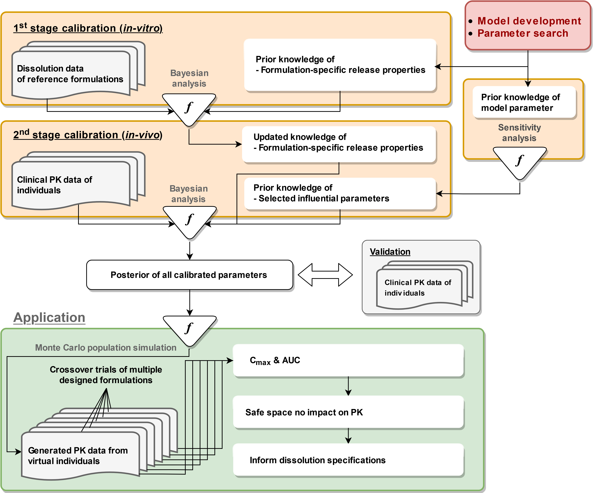
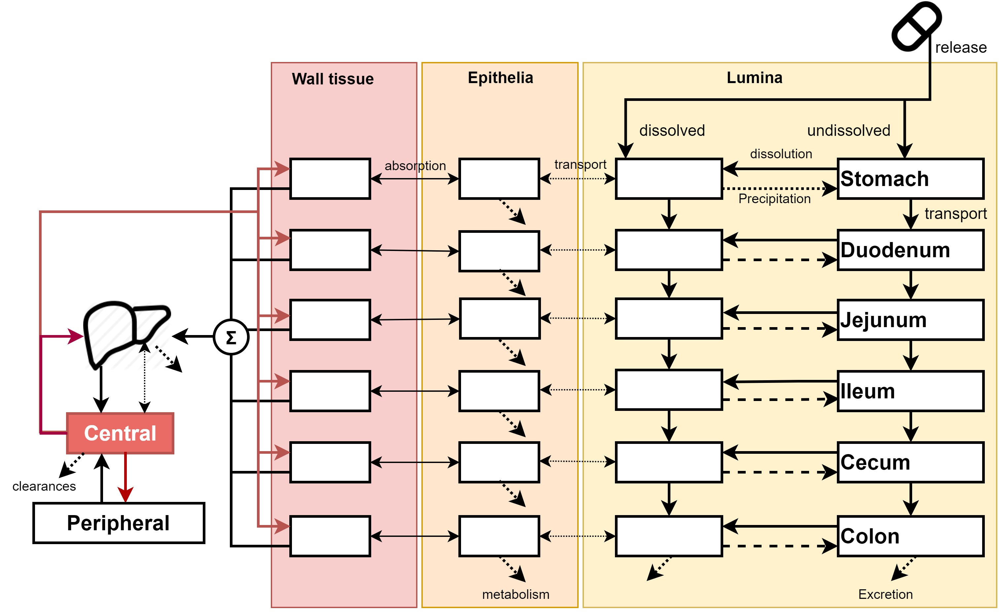
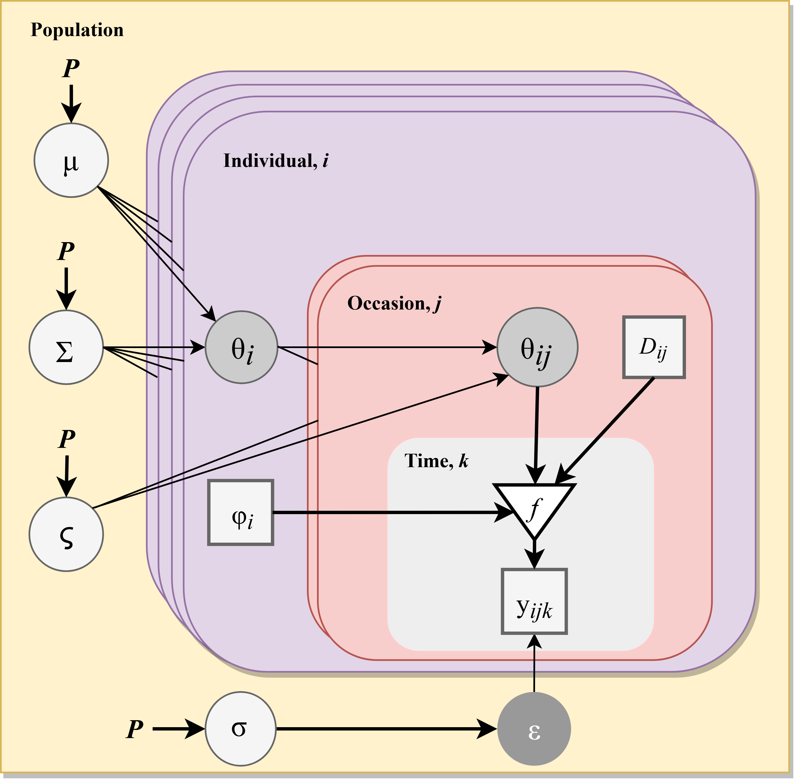
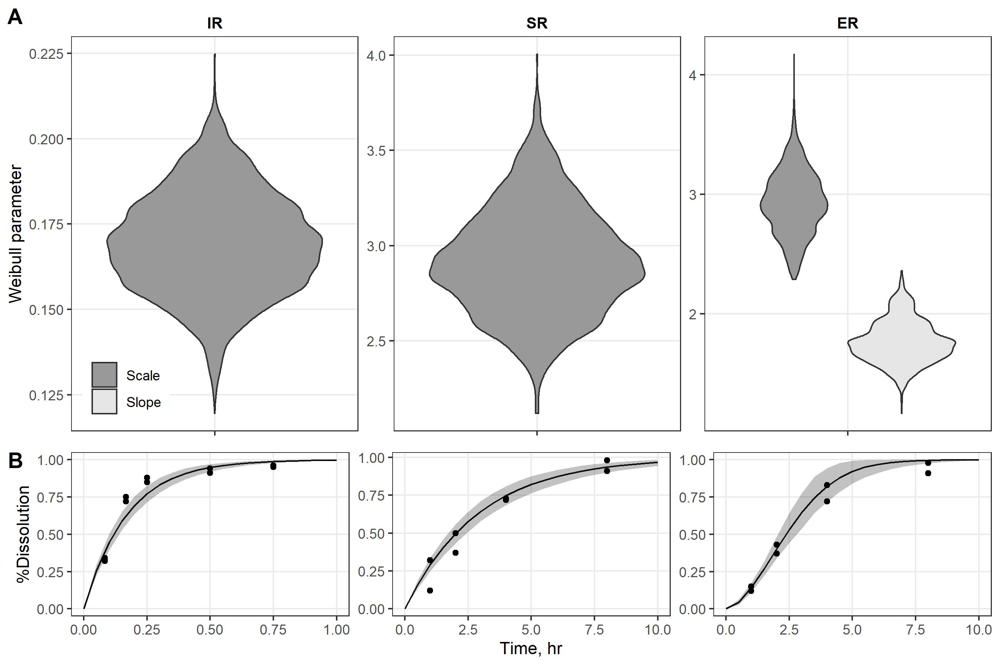
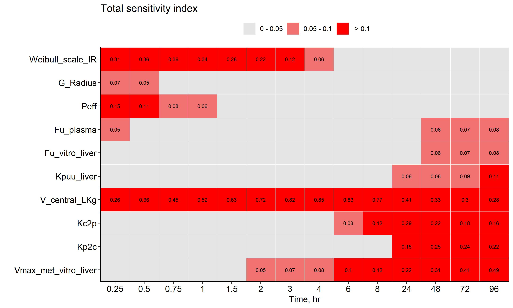
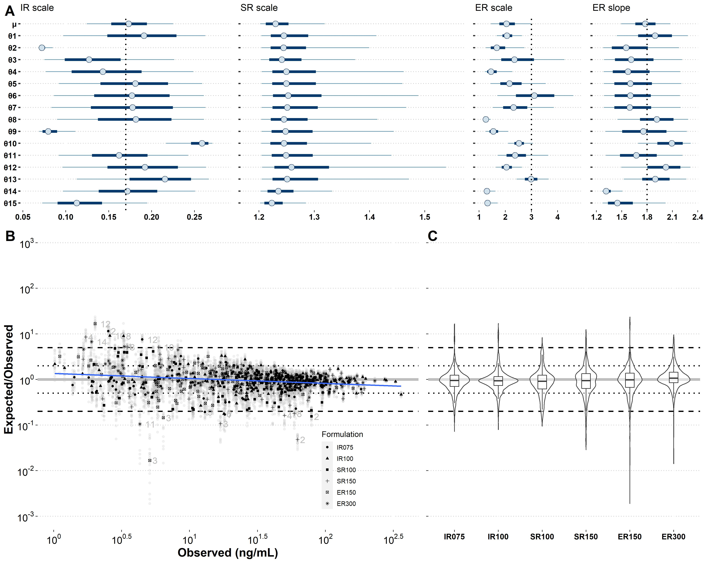
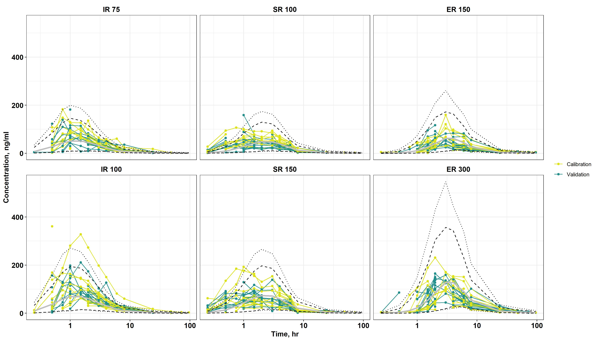
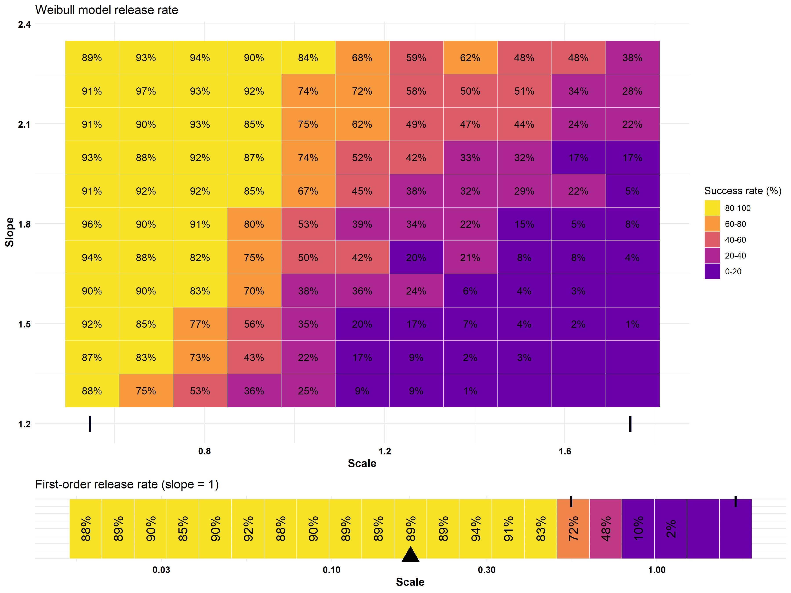
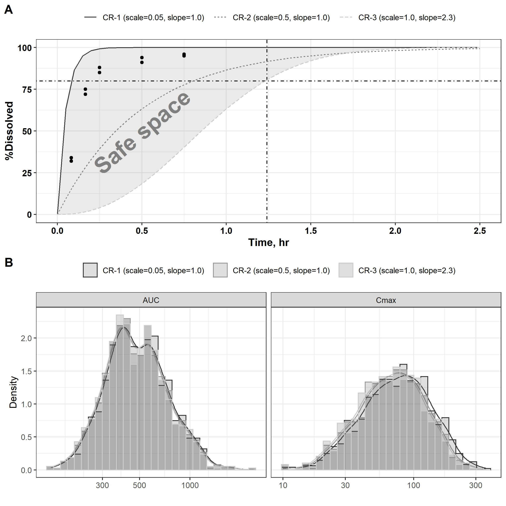

```{r setup, include=FALSE}
options(tinytex.verbose = TRUE)
knitr::opts_chunk$set(eval = T)
```

```{r export, eval=F, echo=F}
rmarkdown::render("manuscript.Rmd")
```

```{r citation, eval=F, echo=F}
citr::md_cite("", bib_file = "references.bib")
```

\hfill
<br>

^1^Department of Veterinary Integrative Biosciences, College of Veterinary Medicine and Biomedical Sciences, Texas A&M University, College Station, TX, USA;
^2^Simcyp Division, Certara UK Limited, Sheffield, UK;
^3^Division of Quantitative Methods and Modeling, Office of Research and Standards, Office of Generic Drugs, Center for Drug Evaluation and Research, U.S. Food and Drug Administration, Silver Spring, MD, USA;
^4^Office of Biostatistics, Division of Biometrics VIII, Center for Drug Evaluation and Research, U.S. Food and Drug Administration, Silver Spring, MD, USA;
^5^Chemical and Biological Engineering and School of Biomedical Engineering, Colorado State University, Fort Collins, CO, USA.

\hfill
<br>

$^*$ To whom correspondence should be addressed: 

Weihsueh A. Chiu, Ph.D., Department of Veterinary Integrative Biosciences, Texas A&M University, College Station, TX 77843; wchiu@tamu.edu

$^{**}$ These authors contributed equally to this manuscript.

\newpage

Abstract {#abstract .unnumbered}
================================

We propose a Bayesian population modeling and virtual bioequivalence assessment approach to establishing dissolution specifications for oral dosage forms. A generalizable semi-physiologically based pharmacokinetic absorption model with six gut segments and liver, connected to a two-compartment model of systemic disposition for bupropion hydrochloride oral dosage forms was developed. Prior information on model parameters for gut physiology, bupropion physicochemical properties, and drug product properties were obtained from the literature. The release of bupropion hydrochloride from immediate-, sustained- and extended-release oral dosage forms was described by a Weibull function. *In vitro* dissolution data were used to assign priors to the *in vivo* release properties of the three bupropion formulations. We applied global sensitivity analysis to identify the influential parameters for plasma bupropion concentrations and calibrated them. To quantify inter- and intra-individual variability, plasma concentration profiles in healthy volunteers that received the three dosage forms, each at two doses, were used. The calibrated model was in good agreement with both *in vitro* dissolution and *in vivo* exposure data. Markov Chain Monte Carlo samples from the joint posterior parameter distribution were used to simulate virtual crossover clinical trials for each formulation with distinct drug dissolution profiles. For each trial, an allowable range of dissolution parameters ("safe space") in which bioequivalence can be anticipated was established. These findings can be used to assure consistent product performance throughout the drug product life-cycle and to support manufacturing changes. Our framework provides a comprehensive approach to support decision-making in drug product development.

**Keywords** Bupropion Hydrochloride; Population pharmacokinetics; Physiologically based pharmacokinetic model; Bayesian inference; Generic drug; Bioequivalence 

\newpage

Introduction
============

Generic drugs aim to increase access to more affordable therapeutic options for patients. To demonstrate bioequivalence (BE) between a brand name product and its generic(s), the “absence of significant difference in the rate and extent to which the active ingredient or active moiety in pharmaceutical equivalents or pharmaceutical alternatives becomes available at the site of drug action when administered at the same molar dose under similar conditions in an appropriately designed study” between the two products should be shown [@fda2017cfr]. The United States Food and Drug Administration (FDA) makes recommendations on BE studies based on current scientific thinking and understanding of a particular drug product. These recommendations are captured in product-specific guidances that are publicly available and updated at regular intervals [@fda2017product].

Bupropion hydrochloride (highly soluble, highly permeable) is a norepinephrine/dopamine reuptake inhibitor that is mainly used for major depressive disorder treatment and support of smoking cessation [@khan2016bupropion]. Bupropion hydrochloride is metabolized into 6-hydroxybupropion and 4′-hydroxybupropion via cytochrome P450 2B6 (CYP2B6) hydroxylation, or into threohydrobupropion and erythrohydrobupropion by carbonyl reductase [@connarn2015metabolism; @sager2016stereoselective]. 6-Hydroxybupropion is the major metabolite of bupropion in the liver. In addition, a study also identified and characterized the metabolism and formation of threo/erythrohydrobupropion in the liver and intestine [@connarn2015metabolism]. Bupropion is currently marketed under several brand name products and numerous generics which provide a range of therapeutic options to the public. Since 2013, per the FDA’s recommendations, BE for these products is demonstrated by conducting *in vivo* studies with pharmacokinetic (PK) endpoints in healthy males and nonpregnant females [@fda2017product].

The use of modeling and simulation approaches provide the opportunity to expand the possibilities of generic drug development and support regulatory assessment [@lionberger2019generic]. In general, for orally administered drug products demonstration of BE may be supported by *in vitro* testing and in vivo studies with pharmacodynamic, PK, and comparative clinical endpoints among others. For products for which applying these methodologies may be challenging, modeling and simulation may play a key role [@zhao2019generating]. Recent studies have shown that *in silico* modeling approaches incorporating *in vitro* dissolution data can be used to predict drug product performance *in vivo* [@al2020vitro; @miao2020using].

PK modeling and simulation are established as essential tools to guide drug development and inform recommendations on therapy individualization [@bonate2011pharmacokinetic]. More specifically, physiologically based pharmacokinetic (PBPK) modeling and simulation methodologies integrate information on patient physiology, physiochemical properties of chemicals, and their absorption, distribution, metabolism, and excretion characteristics. PBPK modeling can be used to support drug product development by investigating mechanistic processes, evaluate hypotheses, guide experimental and study design and inform regulatory decision-making [@zhao2012best; @grimstein2019physiologically].

Regulatory agencies have published guidances and guidelines on PBPK modeling and simulation analyses [@fda2018physiologically; @european2018guideline]. Further enhancements on PBPK modeling methodologies allow accounting for formulation attributes such as *in vitro* dissolution testing and particle size distribution, among others [@suarez2018applications; @heimbach2019dissolution; @kesisoglou2015application; @butler2019vitro]. The integration of biopharmaceutics within the framework of PBPK modeling and simulation supports the establishment of clinically relevant drug product specifications by leveraging a link between drug product quality attributes and *in vivo* exposure [@pepin2020current].

Advanced population modeling approaches can be used to investigate the sources of variability in PKs and find the model parameters' probability distributions that can be further applied in simulations towards addressing drug development questions [@mould2013basic]. The interest in Bayesian methods for BE illustrates how questions about BE have generated much-needed advances in statistical methodologies for drug product comparisons [@lionberger2019generic]. Notably, the Bayesian-based approach is suitable for population PBPK and quantitative systems pharmacology models for model-informed drug development and regulatory decision-making [@jamei2020pbpk; @gelman1996physiological; @zurlinden2016novel].

Advanced population modeling approaches can be used to investigate the sources of variability in PKs and find the model parameters' probability distributions that can be further applied in simulations towards addressing for drug development questions [@mould2013basic]. The interest in Bayesian methods for BE illustrates how questions about BE have generated much-needed advances in statistical methodologies for drug product comparisons [@lionberger2019generic]. Notably, the Bayesian-based approach is suitable for population PBPK and quantitative systems pharmacology models for model-informed drug development and regulatory decision-making [@jamei2020pbpk; @gelman1996physiological; @zurlinden2016novel].

The ultimate goal of this study is to identify a dissolution "safe space", the design area within which drug product batches produced can be anticipated to be bioequivalent [@pepin2020current], by integrating *in vitro* and *in vivo* data within an *in silico* Bayesian approach. Bupropion hydrochloride was used as a model drug in our study.


Material and Methods
====================

The overall study workflow is shown in **Fig. 1**. Briefly, we firstly developed a PBPK absorption model based on the well-known compartmental absorption and transit (CAT) model [@lawrence1999compartmental], which describes the drug dissolution, absorption, and transit in the gastrointestinal tract (the model equations are provided as Supplemental Material). We leveraged scientific publications to inform prior distributions for the PBPK model parameters. Since our model has about a hundred parameters that are very computationally intensive for *in vivo* model calibrations, we conducted a global sensitivity analysis (GSA) to find the most influential parameters on plasma bupropion concentrations (output variable). Two successive model calibrations (Bayesian Stage I and Stage II, using *in vitro* data and *in vivo* data respectively) were implemented to determine the Bayesian posterior distribution of the relevant model parameters. We used the *in vitro* data to estimate an interim posterior distribution of bupropion dissolution parameters (Bayesian Stage I). Half the number of subjects of the clinical PK data were used to estimate the final posterior distribution for the most influential model parameters (Bayesian Stage II) and were used for model calibration as the training set. The data on the remaining subjects were used to assess the predictability of the calibrated result. Virtual BE trials were simulated for the various drug formulation variants by changing the dissolution-related parameters of the drug product [@bois1994abioequivalence]. We then determined a "safe space" of drug dissolution-related parameters where conclusions regarding BE are unaffected. Details are given in the following sections.


## Study Data

### *In vitro* dissolution data

This study focused on immediate-release (IR), sustained-release (SR), and extended-release (ER) bupropion hydrochloride orally administered drug products. Two strengths per dosage form were used for model development: 75 and 100 mg IR tablets, 100 and 150 mg SR tablets, and 150 and 300 mg ER tablets. For the various products modeled in this study, the U.S. FDA provided mean dissolution profiles across various lots of the relevant bupropion hydrochloride formulations to serve as model inputs.

### Human clinical data

PK data from a published clinical study on bupropion hydrochloride was used for model calibration [@connarn2017pharmacokinetics]. In a six-occasion (three formulations with 2 different levels of doses) crossover study design, thirty subjects completed all study periods with a 75 mg single dose of bupropion hydrochloride immediate-release (IR), 100 mg IR, 100 mg sustained-release (SR), 150 mg SR, 150 mg extended-release (ER), and 300 mg ER tablets for each period. Between each treatment, a minimum of 10-day was required as the washout period. The body weight of the study participants ranged from 56 - 104 kg. Sample collection took place at 0.25, 0.5, 0.75, 1, 1.5, 2, 3, 4, 6, 8, 24, 48, 72, and 96 hours post-drug intake.

## Physiologically Based PK Absorption Model

The structure of the developed PBPK absorption model is shown **on Fig. 2**. The gastrointestinal tract is composed of six segments (stomach, duodenum, jejunum, ileum, cecum, and colon), linked to a liver compartment. After absorption from the gut, the active pharmaceutical ingredient (API) reaches the liver through the portal vein (red arrows). The liver also has its own arterial blood supply. Systemic disposition is empirically described by a two-compartment model. Each gastrointestinal tract segment has a lumen compartment, an epithelial layer compartment, and an underlying tissue (wall) compartment. After drug formulation intake, the API can be either dissolved or undissolved in the gut lumen. The dissolution model is also included in the PBPK absorption model to describe API release over time in the gut. Those two states are in equilibrium with each other through dissolution and precipitation. The API will transit through the gut and reach the colon if not absorbed into the epithelial layer. The API availability for absorption at the various gut segments can be defined by the user. In our case, we assumed that dissolved bupropion could be absorbed in the intestine (all segments in **Fig. 2** except the stomach). The model allows for active protein-mediated influx and efflux transport between the epithelium and lumen regions. In the epithelial layer, the drug can be either metabolized or diffuse passively through the wall tissue. In the wall tissue, the API can diffuse passively back to the epithelium or be carried to the liver via the portal vein blood flow. In the liver, transport of the API can occur between blood and the tissue, in addition to passive diffusion. We assumed renal clearance to occur from the central compartment (lumping kidney and plasma). The drug can recirculate to the liver and gut wall through arterial blood flow. The details of model equations are summarized in the Supplemental Material.

## Sensitivity Analysis

GSA was used to evaluate the impact of model parameters on bupropion plasma concentration, following drug intake [@hsieh2018applying]. Parameter sensitivity analysis – including single parameter effects and multiple parameter interactions – was performed with the extended Fourier amplitude sensitivity test (eFAST) [@saltelli1999quantitative]. The total order sensitivity index, which is the sum of the first-order and interaction effects, was used to select the model parameters to calibrate. **Tables S1** and **S2* shows the parameters' default values and ranges of their uniform sampling distributions used in sensitivity analysis. Parameters for which the total order sensitivity index was less than 0.05 (less than 5% contribution to total variation) at all time-points were not calibrated and left at their default value. Convergence assessment [@sarrazin2016global] was conducted to ensure that the sensitivity indices were similar across replications of the analysis with the same sample size. We ran 8000 simulations, making sure that a convergence index lower than 0.05 (less than 5% variation across replicated sampling and analysis) was obtained.

## Bayesian Modeling

A Bayesian statistical framework was used to obtain samples from the joint posterior probability distribution of the model parameters [@gelman1996physiological; @zurlinden2016novel; @zurlinden2017characterizing]. Those posterior samples were then used for predictive simulations. Bayes’ rule can simply be expressed as [@gelman2013bayesian; @bois2013Bayesian],

$$p(θ|y) \propto p(θ)p(y|θ)$$
where *p*(*θ*) represents the prior probability distribution of parameters *θ* in the PBPK absorption model; *y* represents the observed bupropion quantities dissolved (*Q*) in Bayesian Stage I, or plasma concentrations (*C*) in Bayesian Stage II calibration, respectively; *p*(*y*|*θ*) is the likelihood of those data, given *θ*; *p*(*θ*|*y*) is the posterior probability density of the model parameters *θ*, given the data. Note that this is a joint posterior distribution, *i.e.,*, a complex and intractable multivariate distribution taking covariances into account.

To obtain parameter samples from their joint posterior distribution, independent Markov Chain Monte Carlo (MCMC) simulations were performed for each Bayesian data analysis (Bayesian Stage I and II). In each case, we ran five MCMC simulations of 100,000 iterations, the first-half of them being discarded as warm-up iterations. To reduce sample storage size, we saved only one parameter vector for every hundred iterations. We used the Gelman-Rubin potential scale reduction factor $\hat R$ [@gelman1992inference] to monitor the within- and between-chains variances and assess whether the independent Markov chains had converged to a consistent distribution. $\hat R$ asymptotically approached one as the chains converges and $\hat R \gg$ 1 indicated weak convergence. A sequence of MCMC runs giving values of $\hat R \leq$ 1.05 was considered to have approximately converged.


### *In vitro* dissolution data modeling

We used a Weibull function with scale (*β*) and slope (*γ*) to model the *in vitro* drug dissolution kinetic profile data obtained experimentally. Let $Q_{j,k}$ denote the quantity of drug released in the *j*^th^ occasion at time point *k*, and *D~j~* the *in vitro* dose for the *j*^th^ occasion. $Q_{j,k}$ is assumed to be log-normally distribution with the geometric population mean $E(Q_{j,k} |β,γ)$ given by Equation (2) below, and a geometric SD of 1.1 based on the observed dissolution profiles for the three formulations (similar for all formulations). 

$$E(Q_{j,k}|\beta, \ \gamma) = D_j \frac{\gamma}{\beta}\left(\frac{t_{j,k}}{\beta}\right)^{\gamma-1}\text{exp}(-(\frac{t_{j,k}}{\beta})^{\gamma})$$

We used noninformative uniform prior distributions for the Weibull parameters: *β*∼U(0.1, 5) and *γ*∼U(1.1, 6), ), except when modeling a first-order dissolution rate, in which case *γ* was set at value 1.

### *In vivo* inter- and intra-individual variability modeling

We constructed a population model and calibrated the most sensitive PBPK model parameters at the subject and population level, together with their inter-subject and inter-occasion variances. The list of those parameters is given in **Table S4**. The structure of that hierarchical statistical population model is shown in **Fig. 3**.

For subject *i* on occasion *j*, the plasma bupropion concentration data at *k*^th^ time *t~i,j,k~* was assumed to be normally distributed:

$$C_{i,j,k} \sim N(f(D_{i,j}, \ \xi_{i,j}, \ t_{i,j,k}), \ \sigma_{vivo}) $$
Where *f* is the PBPK model described above, *D~i,j~* the bupropion dose received by subject *i* on occasion *j*, *ξ~i,j~* is a vector of similarly indexed occasion-level model parameters (selected through sensitivity analysis), and *σ~vivo~* is the standard deviation of the measurement error. We used a normal distribution to ensure accurate simulations of the maximum plasma concentration, *C~max~*, because *C~max~* is one of the key parameters to describe a plasma PK profile adequately.

The logarithms of the occasion-level parameters *ξ~i,j~* were assumed to be normally distributed with a vector of subject-level geometric means  *ξ~i~* and variances *ς* in log-space (one mean and variance per parameter):

$$\log(\xi_{i,j}) \sim N(\log(\xi_i), \ \varsigma)$$
Truncation within the bounds shown in **Table S4** were applied to each *ξ~i,j~* The logarithm of each subject-level mean *ξ~i~* was assumed to be normally distributed with a vector of population-level geometric means *μ* and variances *Σ* in log-space (one population mean and variance per parameter):

$$\log(\xi_{i}) \sim N(\log(\mu), \ \Sigma)$$
Truncation within the bounds shown in **Table S4** were applied to each *ξ~i~*. The population means' prior distributions are given in **Table S4**. Taken advantage of published information, some of the priors were informative. The prior distributions of all inter-subject variances *Σ* were set to be half-normal with an SD of 0.3; the prior of inter-occasion variances *ς* for parameters *Peff*, *Vmax_met_vitro_liver*, *V_central_LKg*, *Kc2p*, and *Kp2c* were set to be half-normal with an SD of 0.1; for the other parameters, inter-occasion variance was assumed to be zero; the above model implies that covariance matrices were diagonal [@bois2013Bayesian]. The prior distribution of *σ~vivo~* was set to be half-Cauchy with a scale parameter of 10 [@gelman2006prior].

## Model Validation 

Half of the dataset of plasma bupropion concentrations were used in model calibration, with the rest of the data were used for model validation. For model validation, we selected the iteration with maximum a posterior (MAP) estimation across MCMC chains after the warm-up period. We used Monte Carlo simulations with the MAP population means and variances to generate virtual subjects and simulated data, according to the population model described above.


# Virtual Clinical Trial Simulations

To define the dissolution "safe space" for IR bupropion formulations, we randomly selected 100 "trial-specific" parameter vector samples from their joint posterior distribution and used each of them to simulate virtual BE trials. 
In each trial, 100 mg of an oral IR product (considered as the reference drug product within the context of a BE assessment) and bupropion variant formulations (serving as test drug product within the context of a BE assessment) were administered to 100 subjects on two occasions. Since hundreds of test formulations were virtually tested, 10,000+ clinical trials of 100 subjects were simulated. The number (100) of virtual individuals included in each trial was based on the estimated coefficient of variation of bupropion *C~max~* and *AUC~t~*, using an iterative evaluation of the power of the two one-sided t-tests procedure at Type I error probability α 0.05 and target power 0.8 (*sampleN.TOST* function of the R *PowerTOST* package) [@chow2001sample].

Subject and occasion parameters values for the 100 virtual subjects exposed to the reference formulation were simulated using the trial-specific sample of population means, inter-individual and inter-occasion variances, based on the population model described above. Body masses, which were known covariates in the dataset used for calibration, needed to be sampled randomly for each subject (without inter-occasion variability). To that effect, we used a truncated normal distribution with mean 80.9 kg, a SD of 12.7 kg and bounds of 50 kg and 110 kg. For variant formulations, the subject-level Weibull dissolution parameters were first systematically shifted by set amounts to simulate differences in formulation. Then, occasion level parameters values were resampled for each subject using the distribution specified by Eq. 4. For each subject, we generated simulated bupropion plasma concentration data at the sampling times used by @connarn2017pharmacokinetics and estimated the peak concentration (*C~max~*) and the area under the concentration versus time curve (*AUC~t~*) from time zero to the last sampling time point (96 hours). 

The geometric mean ratios (GMR) of *C~max~* and *AUC~t~* between test (formulation variant) and reference and their 90% confidence intervals (CI) were used for BE assessment according to the two one-sided *t*-tests procedure. If the 90% CI of GMR for both PK parameters were located within the BE limits of 80 to 125%, the trial received a "passing" designation. Among the 100 trials simulated for each formulation variant, the number of passing trials gave directly the expected success rate of similar real-life trials.

## Data Processing and Reproducibility

All data analysis and graphics were conducted under R [@R2020]. We used the R *pksensi* package [@hsieh2020pksensi] to perform GSA. Bayesian MCMC analyses were performed with *GNU MCSim* v6.1.0 [@bois2009gnu]. Preliminary MCMC testing and simulations were performed on a high-performance computing cluster at Texas A&M University, with Intel Xeon 2.5GHz E5-2670 v2 machines running Linux CentOS (v7) distribution. An Intel Xeon 3.5GHz F5-1650 v2 12-core processors desktop workstation with Windows 10 x64 was used to obtain the final results. RStudio was used as an integrated development environment for modeling, post-processing, and documentation [@RStudio2019]. All model codes and raw data are provided in the Supplemental Materials and have been logged on GitHub (https://github.com/Nanhung/bup-cat).

Results
=======

## Stage I Calibration - *In vitro* Dissolution Properties

Model calibration with *in vitro* dissolution profiles was conducted under the assumption of either first-order (*i.e.,*, Weibull slope coefficient set at 1) or Weibull release (single-phase) patterns. Results shown in **Fig. 4** suggest that IR and SR formulations were more likely to follow the first-order release pattern. Five MCMC chains with 100,000 iterations were conducted to obtain a posterior sample of slope and/or scale dissolution parameters. **Table S3** summarizes the stage I posterior distribution obtained for those parameters. They converged well with a maximal convergence criterion $\hat R$ lower than 1.02. **Fig. 4A** shows that the scale parameter of the IR and SR formulations has 90% credible intervals 0.14 to 0.19 and 2.47 to 3.37, reflecting the half-lives ranging from 5.8 to 7.9 minutes and 1.7 to 2.3 hours, respectively. The estimated scale coefficient for the ER formulation is similar to that of the SR one (90% credible intervals: 2.49 to 3.33). Data fit in **Fig. 4B** show that SR and ER had similar release time profiles. Those *in vitro* calibration results provided us with priors for the *in vivo* calibration step, for which the prior distributions of Weibull scales were therefore set to *N*(0.17, 0.034), *N*(3.0, 0.6), and *N*(3.0, 0.6) for IR, SR, and ER, respectively, which implies a 20% CV. Those priors were truncated at ± 3SD. The Weibull slope prior for ER *in vivo* calibration was set to *N*(1.8, 0.18) truncated at ± 3SD; for IR and SR formulations the slope was assigned value 1.

## Identification of Influential Parameters

Eighty-eight model parameters related to physiological, PK, and physicochemical properties were examined for their effect on plasma bupropion concentration. With the first-order release model, only 10 parameters were above the 5% sensitivity index limit and were deemed "influential." **Fig. 5** shows the total sensitivity indices of those parameters at the different time points. Besides the drug-release-related Weibull parameters and three parameters of the two-compartment model (volume of the central compartment, *V_central_LKg*, and transfer rate constants between central and peripheral compartments), we identified six other influential parameters: Galenic radius (*G_radius*), effective permeability of gut epithelia (*Peff*), fraction unbound in plasma (*Fu_plasma*), fraction unbound in liver (*Fu_vitro_liver*), liver partition coefficient (*Kpuu_liver*), and maximum metabolism rate in liver (*Vmax_met_vitro_liver*). Overall, the volume of the central compartment was the most influential parameter across the entire predicted bupropion plasma PK profile that its total sensitivity index ranged from 0.17 (at 96 hours) to 0.9 (at 3 hours). The *Weibull_scale*, *G_radius*, and *Peff* had a relatively high impact on plasma bupropion concentration during the absorption phase (prior to *C~max~*). The rest of the identified parameters (*Fu_plasma*, *Fu_vitro_liver*, *Kpuu_liver*, *V_central_LKg*, *Vmax_met_vitro_liver*, *Kc2p*, *Kp2c*) mainly impacted the predicted PK profiles post *C~max~*.

## Stage II Calibration - In vivo Pharmacokinetics

**Table S5** summarizes the stage II posterior distribution of parameters calibrated with MCMC simulations. The marginal posterior distributions of the population mean values, inter-, and intra-variances are shown in **Fig. S1-S3**. The posterior distribution of the IR, ER, and SR *in vivo* dissolution parameters, for the population and each individual in the calibration set are shown in **Fig. 6A**. Subjects 2 and 9 had low Weibull scale estimates (high release rate) in the IR formulation due to very early peak concentrations (at 0.5 hour). On the other side, subject 10 had relatively high estimations. With the SR formulation, all estimates of the *in vivo* Weibull scale were lower than the ones obtained *in vitro*, suggesting that the *in vivo* drug release did not agree with the *in vitro* dissolution data. Conversely, the posterior population mean of the Weibull scale coefficient for the ER formulation predicted faster *in vitro* than *in vivo* dissolution.

The relative prediction errors (*i.e.,*, the E/O ratios of expected over observed concentrations) and their probability distributions for all formulations are shown in **Figs. 6B** and **6C**. Because of the normal error model assumed, the E/O ratios at high concentration levels are less spread than at low concentrations. Yet, no significant correlation exists in these errors (**Fig. 6B**). The calibrated individual PK profiles are shown in **Fig. S4**. The estimated accuracy (proportion of E/O ratios between 0.5 and 2) are very similar across formulations and dosages (82%, 86%, 74%, 74%, 77%, and 84% for IR75, IR100, SR100, SR150, ER150 and ER300, respectively). 

To validate the calibrated model, we simulated 500 virtual subjects receiving the various bupropion hydrochloride formulations and compared their predicted plasma PK bupropion profiles to observed data (**Fig. 7**). In each case, the median predictions are well predictive of the data. The confidence limits are asymmetrical and seem a bit too wide, but note that they are based on inference with only half of the data. For the IR and SR formulation, the simulation result was found adequate as only a few experiment data exceed the 99% upper limits. However, for the ER formulation, under the high dosage (ER300), the simulated PK profiles for plasma bupropion might have a tendency to over-predict systemic exposure when compared to observed data.  

## Virtual BE Assessment

We selected the IR 100 mg product as a reference to assess the impact of dissolution parameters on the BE assessment outcomes for hypothetical formulation variants. The mean estimated values for the reference  *C~max~* and *AUC~t~* parameters from all virtual individuals (100 trials of 100 subjects each) were 74.3 (95% probability interval: 15.1 to 179.0) ng/ml and 522 (95% probability interval: 183 to 1315) ng·hr/ml, respectively. For that product, a first-order release assumption was adequate (maximum posterior release rate = 5.88 per hour).

To simulate formulation variants, we tested 21 different mean Weibull scale values ranging between 0.017 and 1.7. The BE success rate dropped below 80% when the Weibull scale *β* was higher than 0.55 while the slope was maintained equal to 1 (**Fig. 8** bottom). To explore the potential effect of varying Weibull slopes, *γ*, we focused on a region of *β* scale coefficients ranging from 0.55 to 1.75 and tested for BE virtual formulations with mean Weibull slopes ranging from 1.3 to 2.3 (expected to lead to improvement of BE in that critical region). When exploring the formulation space of both *β* and *γ* coefficients, we found that increasing *γ* extends the “safe space” up to *β* values of 1.02 (**Fig. 8**, top). The boundaries of the *β* and *γ* coefficients region leading to acceptable *C~max~* and *AUC~t~* based BE success rate (higher than 80%) define quantitatively a dissolution "safe space."

**Fig. 9A** shows the dissolution profile of three formulations at the boundaries of the "safe space" – (*β*, *γ*) values at (0.05, 1.0), (0.5, 1.0), and (1.0, 2.3). To maintain BE assessment passing outcomes, bupropion *in vivo* release half-life in the gut can extend from minutes to one hour, as long as it reaches 100% release in 2 hours. Using our PBPK absorption model, we further generated 900 random individuals and simulated their bupropion plasma PK profiles after the intake of the three above formulations; **Fig. 9B** shows histograms of the calculated *C~max~* and *AUC~t~* values based on the simulated populations. The estimated *AUC~t~* have a predicted variability of about two orders of magnitude, without noticeable differences among the three formulations. The estimated *C~max~* also has the same predicted variability. The formulation with the highest release rate has the highest average *C~max~*, as expected.

Discussion
==========

Our study leveraged *in vivo* exposure and *in vitro* dissolution data towards the development of a mechanistic PBPK model integrating Bayesian algorithms with the aim of informing decisions supporting generic drug development. Recent studies have applied the concept of integration of *in vitro* dissolution and *in silico* modeling towards performing virtual BE assessments [@loisios2020establishing; @jereb2020vitro; @miao2020using]. The use of PBPK modeling in establishing clinically relevant dissolution specifications and performing virtual BE assessments for oral products has been mentioned and applied in recent studies [@mitra2019maximizing; @mitra2019physiologically; @miao2020using]. Virtual BE trials were also used to address questions relevant to generic drug product development [@pepin2016justification; @babiskin2015application]. @loisios2020establishing applied a mechanism-based absorption PBPK model with in vitro bio-relevant dissolution testing towards a virtual BE assessment for a BCS class II weak acid drug, naproxen. That study highlighted the importance of linking translational absorption modeling with population PBPK to set clinically relevant specifications. @jereb2020vitro designed modified-release capsules using a commercial PBPK absorption model to control the effect of *in vitro* dissolution effect on the *in vivo* product performance; an alternative IVIVC approach was used to propose dissolution specifications for a hypothetical generic drug product. Finally, @miao2020using developed and applied a PBPK absorption model to establish dissolution BE "safe space" for oseltamivir (BCS class I or III) to treat influenza A and B infections in both adult and pediatric populations. The developed model was used to provide a quantitative basis for setting clinically relevant dissolution specifications for the pediatric populations in which performing clinical PK trials is not feasible due to ethical reasons.

We demonstrated the use of a Bayesian PBPK approach is able to integrate the available *in vitro* and *in vivo* information on drug PK and study subjects’ physiological characteristics to support generic drug evaluation via virtual clinical trials, *i.e.,*, virtual BE assessment. Bayesian statistical methods can seamlessly integrate information obtained at various steps of sequential data collection under the form of joint posterior parameter distributions bringing all the available knowledge to decision-making. As far as we know, this is the first application of a Bayesian PBPK approach to establishing a dissolution BE "safe space". A Bayesian PBPK modeling framework allows for a rigorous data treatment workflow. It gave us the opportunity to quantify both uncertainty (the level of confidence in model parameters and their predictions) and variability (the degree to which predictions may differ between and within the individuals), and further applied the knowledge we gained in model calibration to conduct the advanced model prediction and application. A Bayesian approach is particularly adapted to the calibration of PBPK models, because those models convey a lot of information under the form of prior distributions of physiological or anatomical parameters, including information about the variances and covariances of those parameters in the population. This method can also potentially distinguish between general and sensitive individuals through quantified population variability. Therefore, our approach provides a more comprehensive framework for establishing dissolution BE "safe space." 

One important aspect of Bayesian PBPK modeling is that the structural PBPK model not only describes mean processes, but can also include sub-models for variances and covariances at the population or individual level. Bayesian calibration of PBPK models can therefore help infer about inter-individual and inter-occasion variability of specific mechanistic parameters from clinically observed concentration profiles’ inter-individual and inter-occasion variance. Given the lack of information on inter-occasion variability, and the limitations of modeling it with added post hoc variability to concentration profiles, it is worth using Bayesian statistical methods to analyze it.

A Bayesian approach has advantages, but it can be computationally intensive when applied to PBPK models. Parameter sensitivity analysis is crucial at early model development stage [@chung2017maximizing]. GSA can provide insight into input parameters variability or uncertainty on model output. Compared to local sensitivity analysis, GSA assesses individual parameter impact and interactive impact of multiple parameters [@liu2020considerations]. To reduce computational burden in Bayesian modeling, most studies typically fix some “felt to be known” model parameters, based on evidence from the published literature, and optimize only a small subset of parameters without further justification. Some studies have proposed applying GSA to PBPK model development [@hsieh2018applying; @mcnally2011workflow; @melillo2019variance]. @melillo2019variance developed a physiologically based absorption model and conducted a variance-based Sobol sensitivity analysis to understand the determinants of absorption and bioavailability. Our study used a similar approach that pointed to effective permeability and particle size as key parameters of plasma bupropion concentration versus time profiles during the first hour following oral administration. Even within our complex PBPK model, only a few parameters had a significant impact (main and interaction effect over 5% concentration change) on plasma concentration. Therefore, GSA may provide with useful insight that reduces the computational burden and maintain the model performance during model calibration and population modeling process.

For *in vitro* dissolution modeling, we found – as in previous reports [@mitra2019physiologically; @ramteke2014mathematical; @yang2016application] – that a Weibull-based function was suitable to quantify drug dissolution profiles. It can be applied to most, if not all, *in vitro* dissolution profiles. Unlike most studies that use a general empirical Weibull function to describe the quantity or proportion released, we applied the function to describe the time-dependent release rate constant which governs the released quantity. With that parametrization, first-order dissolution can be obtained by fixing the Weibull slope coefficient to 1. Our use of the Weibull model is therefore more general and include first-order dissolution as a special, parametric, case. It has more flexibility to fit in vitro release profiles data, and can lead to a useful simplification of the model if needed. Our results show, for example, that a first-order model is sufficient to describe the release of bupropion from the IR and SR formulations, but that a full Weibull model is preferable for the ER formulation. 

According to the U.S. FDA regulatory guidance on PBPK modeling [@fda2018physiologically], model parameters may be optimized during model refinement. Accordingly, we calibrated our model with both *in vitro* and *in vivo* observed data obtained with IR, SR and ER oral dosage forms for bupropion hydrochloride. The *in vivo* data brought in additional information that modified the estimates obtained solely from in vitro data, without discarding all the information the latter carresi. We cannot yet expect *in vitro* data to be entirely predictive of clinical trials and this discrepancy is not linked to a choice of particular statistical methodology. The advantage of the Bayesian approach is that it allows a consolidation of the evidence. Note that there is no strong conflict between our in vitro and *in vivo* estimates of the release parameters. If that were the case, one could choose to keep only one data set (probably the clinical one), or to examine more deeply the cause of that discrepancy. Note that choosing an appropriate prior distribution is usually a challenge for using a Bayesian method. 

There are no performance acceptance criteria established currently in the field of PBPK modelling and simulation. @jereb2020vitro used prediction error as a model validation criterion. @pepin2016justification used (absolute) average fold error to measure the error and bias to the predictions. Following the approach in @gelman1996physiological, we used posterior predictive simulations and validation with part of the data set aside for that purpose. However, some unexpected PK profiles (in particular peak concentrations) in actual subjects were not well captured by the model due to its limitations. Several ways of improvement could be followed: more mechanistic absorption models [@jamei2009population; @dolton2020physiologically], or, more empirically, alternative error models, or better approximations of the population distributions (which we assumed to be Gaussian).

We based our safe space calculations on simulations from posterior distributions obtained after two stages of Bayesian calibration. We only explored safe space in the case of the IR formulation, for which the model fit and predictive check were the best. One could also investigate safe space at the end of the first stage, i.e. with information from in vitro data only. The difference between stage I and stage II estimates would shed some light on the amount of information brought in by clinical experiments. This approach could eventually be extended to added-value-of-information calculations and experimental design.

Overall, the current study showed that integrating *in vitro*, *in vivo*, and *in silico* evidence in a Bayesian framework can provide reliable clinical trial predictions and further guide model informed formulation selection. Our proposed workflow can be used to inform decisions on a patient-centric drug product development for orally administered products by reducing the need for unnecessary and costly clinical trials.

Conclusion
===========

We proposed a workflow integrating a Bayesian statistical approach and a PBPK absorption model to identify *in vitro* dissolution profiles for bupropion hydrochloride IR oral dosage forms leading to a favorable BE assessment. Information from *in vitro* and *in vivo* data was integrated through a two-stage model calibration process. Using a population model, we also quantified separately the effects of uncertainty and variability. Inter-individual and inter-occasion variabilities were accounted for in the simulations to describe population variability in a realistic manner. The proposed workflow exemplifies how PBPK modeling, enhanced by a Bayesian methodology and by leveraging *in vitro* and *in vivo* information can be used to inform decisions related to generic drug product development.

Conflict of interest {#conflict .unnumbered}
=============================================

The authors declare that the research was conducted in the absence of any commercial or financial relationships that could be construed as a potential conflict of interest. Frédéric Y. Bois is currently employed by the CERTARA company but has no conflict of interest.

Acknowledgements {#acknowledgements .unnumbered}
=================================================

Funding for this work was made possible, in part, by the U.S Food and Drug Administration (1U01FD005838) and U.S. National Institute of Environmental Health Sciences (P42 ES027704). This article reflects the views of the author and should not be construed to represent FDA's views or policies. Views expressed in written materials or publications do not necessarily reflect the official policies of the Department of Health and Human Services; nor does any mention of trade names, commercial practices, or organizations imply endorsement by the United States Government.

Author contributions {#contributions .unnumbered}
=================================================

Nan-Hung Hsieh, Frédéric Y. Bois, Eleftheria Tsakalozou, and Weihsueh A. Chiu conceived the overall research concept and design. Nan-Hung Hsieh performed most analyses, simulations, and preliminary manuscript writing. Frédéric Y. Bois developed the physiologically based pharmacokinetic absorption model and most computational experiment design. Eleftheria Tsakalozou, Zhanglin Ni, Miyoung Yoon, Wanjie Sun, and Martin Klein from the U.S. FDA reviewed the manuscript and provide critical comments during the whole research period. Brad Reisfeld is the main funding acquisition and project administration.

Supplemental Materials {#appendix .unnumbered}
===============================================

The following file is provided as Supplemental Materials:

- supplementary.pdf

\newpage

Figure Captions {#figure .unnumbered}
======================================

**Figure 1.** Schematic diagram of the overall study workflow. \newline

**Figure 2.** Schematic representation of the semi-PBPK absorption model (see text). \newline

**Figure 3.** Structure of the *in vivo* data hierarchical model. Circular nodes represent parameter calibrated in a Bayesian framework. Square nodes represent known quantities. *P* are prior distributions. For individual *i*, ξ~i~ is a subject-specific parameter set conditioned by population means *μ* and population SDs *Σ*. On occasion *j*, ξ~ij~ is an occasion-specific parameter set, conditioned by *ξ~i~*  and inter-occasion SDs *ς*. At time *k*, the observed plasma bupropion concentration *Y~ijk~* is determined by PBPK model f predictions and a random error *ϵ* normally distributed with mean zero and SD *σ*. Covariates *ϕ~i~* and bupropion dose *D~i~* also condition model *f* predictions. \newline

**Figure 4.** Bayesian-estimated Weibull dissolution parameters of bupropion hydrochloride immediate release (IR), sustained release (SR) and extended release (ER) formulations. (A) Violin plots of the parameters’ posterior samples. (B) Posterior fit of the dissolution profiles (lines: median predictions; grey areas: 95% probability intervals; dots: *in vitro* experiment data). \newline

**Figure 5.** Heatmap of the time-dependent total order sensitivity coefficients for the 10 most influential parameters of the PBPK absorption model (see text). The indices lower than 0.01are not displayed. \newline

**Figure 6.** (A) Posterior distribution summaries of drug-released related parameters by subject, after MCMC calibration. The thick and thin lines represent 50% and 90% intervals, respectively. The vertical dotted lines represent the maximum posterior estimate from *in vitro* modeling. (B) Posterior predictive checks across formulations and doses. The dotted and dashed lines represent the expected-to-observed ratio over a factor of 2 and 5, respectively. The blue line is a fitted linear regression estimate. (C) Comparative analysis of predictive accuracy and precision. \newline

**Figure 7.** Cross-validation of the observed versus predicted PK profiles of plasma bupropion. The light dots and lines represent the data used for model calibration. The dark dots and lines represent data used for model validation. The median prediction (grey line) is shown for 500 randomly posterior-sampled individuals. The dotted and dashed lines represent the 95% and 99% probability intervals, respectively. \newline

**Figure 8.**  Bioequivalence assessment heat map and passing rates for virtual test IR formulations of 100 mg bupropion hydrochloride with either first-order (bottom) or full Weibull (top) *in vivo* release profiles of bupropion hydrochloride in the gut patterns. The triangle indicates the reference formulation maximum posterior estimate of the Weibull scale (scale was 0.17 and slope was 1.0 for the reference product). A successful BE trial was declared when both geometric mean ratio of *C~max~* and *AUC~t~* between test and reference fell between 80 and 125%. \newline

**Figure 9.** (A) *In vitro* dissolution profiles of three formulations at the boundaries of the dissolution "safe space"; (B) Histograms of simulated bupropion *AUC~t~* and *C~max~* values for 900 virtual subjects receiving the three formulations presented in panel (A). \newline

\newpage



\clearpage
\newpage



\clearpage
\newpage



\clearpage
\newpage



\clearpage
\newpage



\clearpage
\newpage



\clearpage
\newpage



\clearpage
\newpage



\clearpage
\newpage



\newpage

References {#references .unnumbered}
====================================